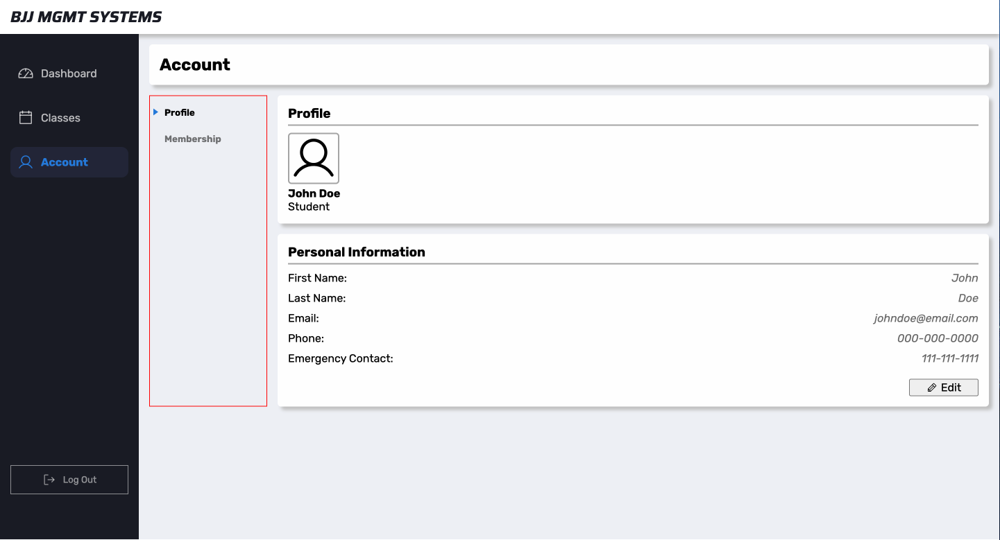

## BJJ Academy MGMT 
This project is a front-end only mock-up of a management system for a Brazilian Jiu-Jitsu academy. It serves dual user models (member and admin) and features simple interactions such as maintaining a to-do list, enrolling in classes, creating class schedules, and more. As a BJJ practitioner, I wanted to experiment with what user needs are most critical when developing mgmt systems.

Login Methods:
- Student:
    - Username: johndoe
    - Password: johndoe
- Coach:
    - Username: janedoe
    - Password: janedoe

## Considerations
As a front-end only application, there are some architectural decisions that must be noted. Without the use of a database or APIs, there is some atypical code that wouldn't adhere to full stack architecture. Instances include:

- Dummy user objects
- Global state of users and user properties
- No authentication middleware
- No persistent authenticator

  # Work-In-Progress Notes
  - Might align to full stack as much as possible by:
        - creating mock APIs
        - using localStorage as mock DB
        - refactor dummy model file to align with relational DB structure

## WIP Screen Shots

